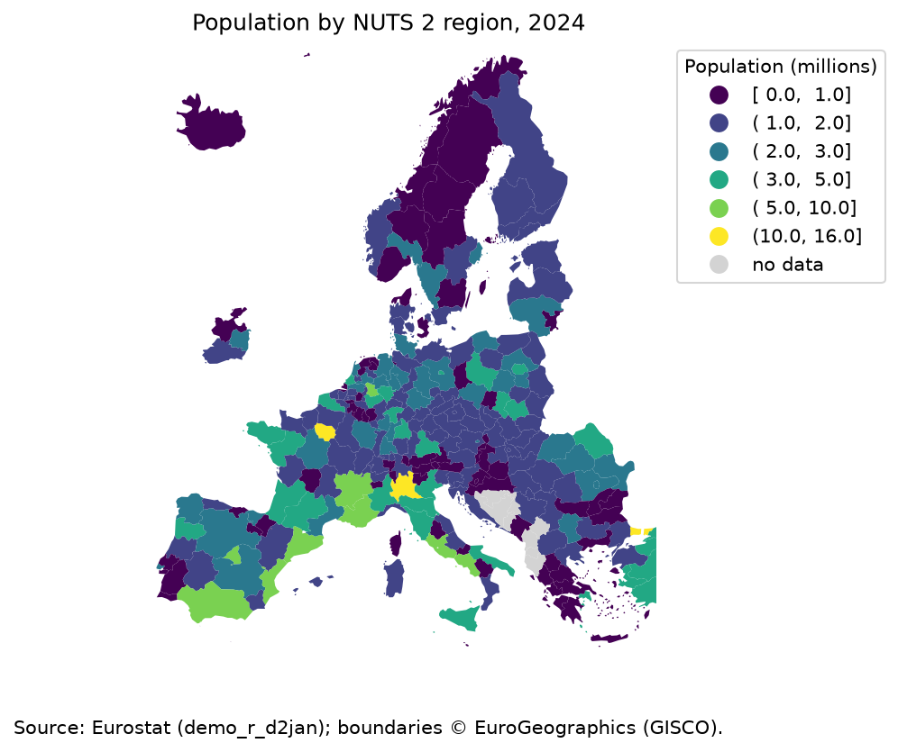
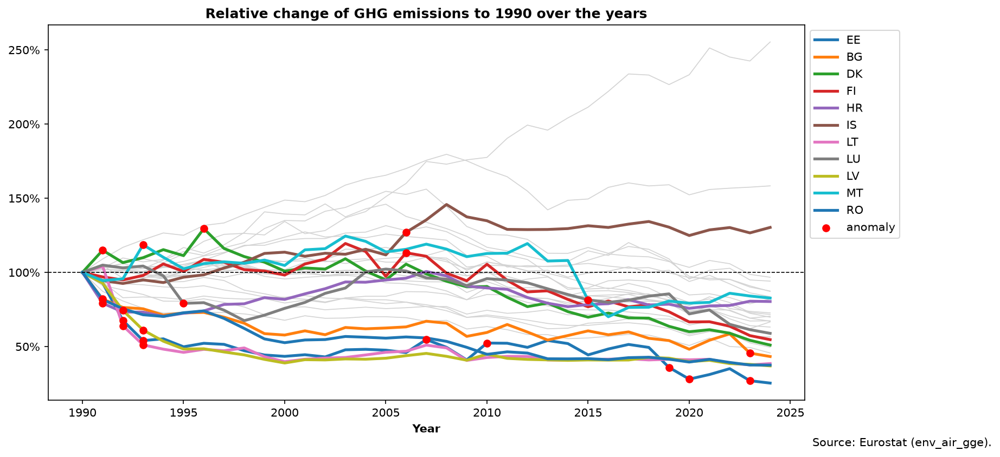

# Eurostat Data-Quality Pipeline

[](https://github.com/RichardPalotai/eurostat-dq/actions/workflows/ci.yml)

Ingests two Eurostat datasets, cleans them, validates them across five data-quality
dimensions (accuracy, completeness, consistency, uniqueness, timeliness), flags anomalies,
and produces a self-contained HTML quality report. A learning project applying statistics
to real, messy public data — built with a config-driven design, a tested codebase, and CI.

**Stack:** pandas · NumPy · SciPy · pydantic · great_expectations · scikit-learn · matplotlib · geopandas · eurostat/requests · pyarrow

---

## Datasets

Both datasets run through one **config-driven registry** (`config.py`), so the same
ingest/clean/validate code serves both — adding a third means one new registry entry.

| | `demo_r_d2jan` | `env_air_gge` |
|---|---|---|
| Meaning | Population on 1 Jan | GHG emissions |
| Geography | NUTS 2 regions (`HU11`) | countries (`HU`) |
| Filters | `age=TOTAL`, `sex=T` | `airpol=GHG`, `src_crf=TOTX4_MEMO`, `unit=THS_T` |
| Unit | `NR` (persons) | `THS_T` (kt CO₂-eq) |
| Valid `geo` | 355 NUTS 2 codes (len 4) | 31 country codes (len 2) |
| Value range | `0`–`20,000,000` | `0`–`2,000,000` |
| Staleness threshold | 1 yr | 2 yr (inventories lag) |

## Key decisions & data quirks

- **`src_crf=TOTX4_MEMO`** — total GHG *excluding LULUCF* (forestry), the standard headline
  figure. LULUCF can be negative (carbon sinks), so excluding it keeps the value floor at `0`.
- **NUTS codes aren't ISO** — Greece is `EL` (not `GR`), UK is `UK` (not `GB`).
- **Mixed geography levels** — `demo_r_d2jan` ships country + NUTS 1/2/3 rows together;
  cleaning keeps only length-4 NUTS 2 codes.
- **Aggregates/residuals dropped in cleaning, not validation.** `EU28`/`EFTA` (aggregates)
  and `*XX` (unallocated) are removed *before* validation. Reason: if `valid_geo` filtering
  happened in cleaning, the consistency check would be tautological. So cleaning filters by
  **structure** (`geo_level` → code length/shape); validation checks **membership**
  (`valid_geo`). Keeping an aggregate would also stretch the accuracy range ~30× (EU28 ≈ 514M
  vs largest region ≈ 15.9M).
- **Emissions data was duplicated across two units** — `MIO_T` and `THS_T` (×1000 apart), so
  every row appeared twice → broke **uniqueness** and made stats meaningless (mean/median = 48,
  looked like skew, was really a unit gap). Fixed by adding `unit=THS_T`. Found by plotting the
  distribution, not by reading rows. (`demo` carries only `NR` — unaffected.)
- **Value ranges are domain-reasoned, not observed.** An observed bound can't be violated by
  its own data (tautological check) and drifts into false positives. Lower `0` generalises
  (nothing is negative); upper is per-dataset (persons vs kt) — which is why `value_range` is
  a registry field, not a shared constant. Emissions floor is `0`, not the observed min (Malta
  1,840 kt), because the data tracks emissions *falling*.
- **Open question:** a population `0` appeared in exploration — kept as an accuracy test case.
- **Future metric:** per-country `*XX` share = a completeness signal worth reporting.

---

## Ingestion — two paths

Both cache to `data/raw/` as Parquet; a cache hit skips the network (`use_cache=False` forces refetch).

| | `fetch_dataset(code)` | `fetch_dataset_json(code, **filters)` |
|---|---|---|
| Source | `eurostat` package | raw REST API + JSON-stat, parsed by hand |
| Shape | **wide** (year columns) | **long** (one row per obs) |
| Filtering | none | **server-side** via query params |
| Cache | `{code}.parquet` | `{code}_json{_dim=value…}.parquet` |

- **Hand-written JSON-stat parser** — the REST response is a serialized n-dim cube
  (`id`/`size`/`dimension` + a sparse `value` dict keyed by flat index). Parser is
  dataset-agnostic: reads dimension order from `id`, decodes flat indices with
  `numpy.unravel_index`. Server-side filtering is *required* — Eurostat returns HTTP 413 on
  overly large queries.
- **Trade-off:** caching the decoded frame drops the JSON-stat metadata (`updated` timestamp,
  `b`/`p`/`e` status flags). Useful for timeliness/anomaly later — would need caching raw JSON.

The canonical shape is **long**; `clean.to_tidy` (wide→long via `melt`) is the wide-path
adapter and a no-op on already-long input, so downstream code can't tell which fetcher ran.

---

## Quality dimensions

Two layers: **row-level** (pydantic, `schema.py`) — each row valid on its own — and
**dataset-level** (great_expectations, `expectations.py`) — collection properties a single
row can't express (e.g. uniqueness). All thresholds come from the registry.

| Dimension | Check | Tool · location |
|---|---|---|
| **Accuracy** | `value` in `value_range` (per row) | pydantic · `Record.value_in_range` |
| | `time` in plausible year range | pydantic · `Record.year_in_bounds` |
| | `value` in `value_range` (column) | GX · `ExpectColumnValuesToBeBetween` |
| **Completeness** | non-null `value` ≥ 90% | GX · `ExpectColumnValuesToNotBeNull` |
| **Consistency** | `geo` in `valid_geo` (per row) | pydantic · `Record.geo_is_valid` |
| | `geo` in `valid_geo` (column) | GX · `ExpectColumnValuesToBeInSet` |
| | exactly one `unit` | GX · `ExpectColumnUniqueValueCountToBeBetween` |
| **Uniqueness** | no duplicate `(geo, time)` | GX · `ExpectCompoundColumnsToBeUnique` |
| **Timeliness** | latest `time` within `staleness_years` | plain check · `run_expectations` |

`run_expectations(df, cfg)` → report dict keyed by dimension (`passed/checked/failed/failed_pct/sample_bad`).
`validate_rows(df, cfg)` → per-row summary with `by_field` breakdown. Timeliness is hand-rolled
(GX has no recency expectation).

---

## Anomaly detection

Two complementary detectors (`anomaly.py`):

- **Per-geo z-score** (`zscore_flags`) — standardises each value against *its own region's*
  history: `z = (value − mean_geo) / std_geo`, flag `|z| > 3`. **Per-geo, not global** —
  because the data is right-skewed, a global z-score would flag large regions every year (they
  permanently sit in the tail). Per-geo asks "unusual *for this region*?" instead.
- **IsolationForest** (`isolation_forest`, `contamination=0.02`) — fits on **year-over-year
  `pct_change`** per geo, not the raw level. Relative change is comparable across regions
  (a −30% drop is −30% for Malta or Germany), sidestepping the skew that raw values reintroduce.

**Shared rule — insufficient history is left `NaN`, never filled with `0`.** A region's first
year (or zero variance) can't be scored; `NaN` honestly means "unassessable", whereas `0` would
falsely claim "normal" and (for IsolationForest) inject a fake dense cluster that distorts the
model. These unscored rows are the **same coverage gaps flagged under completeness** (NUTS
revisions, e.g. `HU11`/`HU12` start in 2001).

**Finding — the two detectors barely overlap, by design.** z-score flags distance from a
region's *average level*; IsolationForest flags unusual *year-to-year movement*. A region can
drift far from its mean via smooth steps (z flags, IF doesn't) or blip one year without leaving
its range (IF flags, z doesn't). They're two lenses, not one lens twice. Both catch a planted
3× spike; on clean data z-score flags ~0.1%, IsolationForest ~2% (= contamination).

---

## Setup

```bash
python -m venv .venv
source .venv/bin/activate          # Windows: .venv\Scripts\activate
pip install -e ".[dev]"
```

## Usage

Run the whole pipeline (ingest → clean → validate → anomaly → figures → report) from the CLI:

```bash
python -m eurostat_dq.cli                       # all datasets (uses the local cache)
python -m eurostat_dq.cli --dataset demo_r_d2jan   # a single dataset
python -m eurostat_dq.cli --no-cache            # force a fresh fetch from the API
python -m eurostat_dq.cli --help                # options
```

Output lands in `reports/`: the figures as PNGs and a self-contained
`quality_report.html` (all figures inlined as base64, so it opens anywhere with no
external files).

## Testing

```bash
pytest
```

13 tests cover the schema validators, the wide→long reshape, the per-dataset slice
(including the invariant `set(geo) ⊆ valid_geo`), and both anomaly detectors. All use
small hand-built fixtures — **no network**, so they run in ~1.5s and pass in CI offline.
GitHub Actions runs them on every push and pull request (see the badge above).

## Results

The pipeline produces a styled [`quality_report.html`](reports/quality_report.html) — per
dataset, a PASS/FAIL badge per quality dimension, tables of flagged and failed rows, and the
figures below with commentary.



*Population is strongly right-skewed: most NUTS 2 regions hold 1–2 million people, a handful
(Île-de-France, Istanbul, Madrid, Lombardy) exceed 5 million. Grey = no matching geometry.*



*Indexed to 1990 = 100%, most countries cut emissions substantially (Estonia −75%, Latvia
−63%); a few rose (Turkey +155%). Red markers are year-over-year anomalies from IsolationForest.*

## What this demonstrates

An end-to-end data pipeline built with production-style practices, applying statistics to
real, messy public data:

- **Config-driven design** — one dataset registry lets the same ingest/clean/validate code
  serve any dataset; adding one is a single registry entry, not new code.
- **A five-dimension data-quality framework** split across row-level (pydantic) and
  dataset-level (great_expectations) checks — the exact vocabulary a data-quality role uses.
- **EDA-driven modelling** — the anomaly method (per-geo, on year-over-year change) was chosen
  *because* the distributions are right-skewed, not by default.
- **Real data-quality findings**, documented: a mixed-unit duplication that broke uniqueness,
  aggregate/residual rows that would have made checks tautological, and domain-reasoned
  thresholds instead of observed ones.
- **Tested and automated** — hermetic pytest suite + GitHub Actions CI + honest dependency
  declaration (CI installs only declared deps, so undeclared imports fail the build).

## Status

| Component | State |
|---|---|
| `config.py` — dataset registry | ✅ |
| `ingest.py` — `fetch_dataset` (wide) + `fetch_dataset_json` (long) | ✅ |
| `clean.py` — tidy + per-dataset slice | ✅ |
| `schema.py` — pydantic row validation | ✅ |
| `expectations.py` — 5 QA dimensions | ✅ |
| `anomaly.py` — z-score + IsolationForest | ✅ |
| `viz.py` — map, trends, histograms, boxplots | ✅ |
| `report.py` — self-contained HTML quality report | ✅ |
| `cli.py` — end-to-end pipeline runner | ✅ |
| tests (pytest) + CI (GitHub Actions) | ✅ |

See [PROJECT.md](PROJECT.md) (build guide) and [PROJECT_PLAN.md](PROJECT_PLAN.md) (milestones/issues).

## License

MIT — see [LICENSE](LICENSE).
